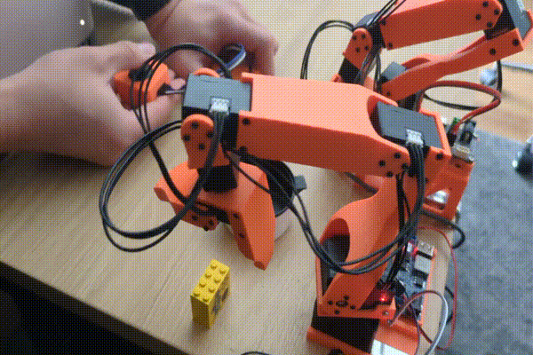

# koch_ros

ROS 2 packages for the Koch v1.1 robot arm, a low-cost 6-DOF manipulator with a gripper.

## Packages

- **koch_description**: URDF/Xacro robot description, meshes, and visualization configs
- **koch_controllers**: Custom ros2_control controllers for the robot

## Controllers

### LeaderFollowerController
Teleoperation controller that mirrors a leader arm's joint positions to a follower arm.

### ClawMachineController

Cartesian velocity controller for the follower arm with gripper control:
- Subscribes to `/cmd_vel` (geometry_msgs/TwistStamped) for end-effector velocity commands
- Subscribes to `/grasping` (std_msgs/Bool) to open/close the gripper
- Uses inverse kinematics with nullspace optimization to minimize end-effector rotation
